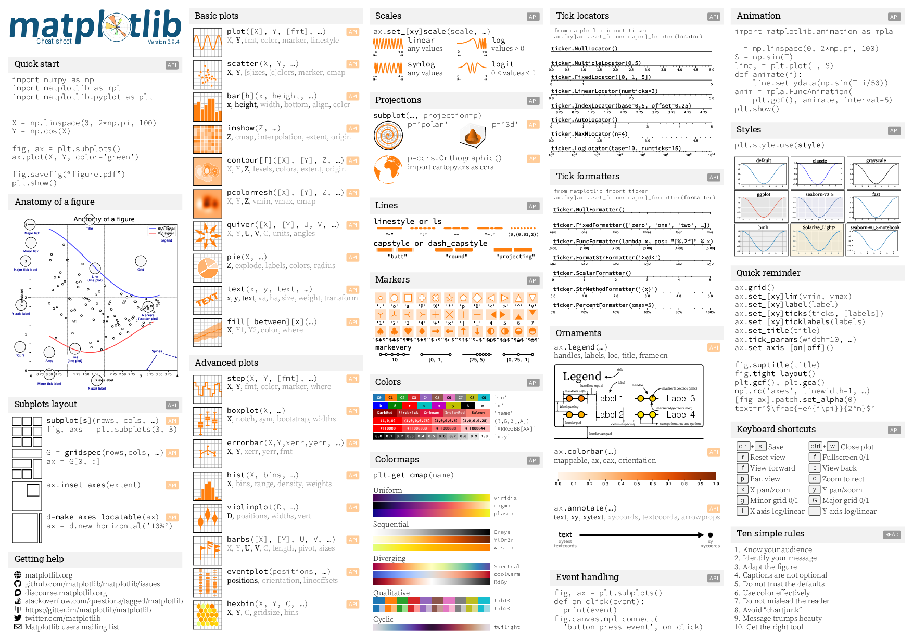

# Cheatsheets




# Handouts


# How to compile

1. You need to create a `fonts` repository with:

* `fonts/roboto/*`           : See https://fonts.google.com/specimen/Roboto
                                or https://github.com/googlefonts/roboto/tree/master/src/hinted
* `fonts/roboto-slab/*`      : See https://fonts.google.com/specimen/Roboto+Slab
                                or https://github.com/googlefonts/robotoslab/tree/master/fonts/static
* `fonts/source-code-pro/*`  : See https://fonts.google.com/specimen/Source+Code+Pro
                                or https://github.com/adobe-fonts/source-code-pro/tree/release/OTF
* `fonts/source-sans-pro/*`  : See https://fonts.google.com/specimen/Source+Sans+Pro
                                or https://github.com/adobe-fonts/source-sans-pro/tree/release/OTF
* `fonts/source-serif-pro/*` : See https://fonts.google.com/specimen/Source+Serif+Pro
                                or https://github.com/adobe-fonts/source-serif-pro/tree/release/OTF
* `fonts/delicious-123/*`    : See https://www.exljbris.com/delicious.html


2. You need to generate all the figures:

```
$ cd scripts
$ for script in *.py; do python $script; done
$ cd ..
```

3. Compile the sheet
```
$ xelatex cheatsheets.tex
$ xelatex cheatsheets.tex
```
